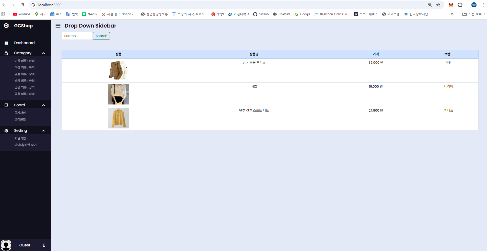
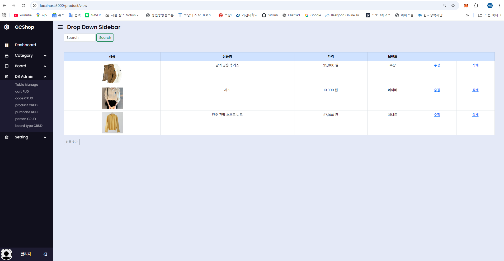
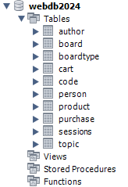

# GCShop (가천샵) 🛒
Node.js(Express) + MySQL + EJS 기반으로 구현한 **쇼핑몰 웹 서비스(개인 프로젝트)** 입니다.  
서버에서 화면(EJS)을 렌더링하는 **SSR(Server Side Rendering)** 구조로 개발했으며,  
**세션 기반 로그인**과 **권한(Guest/Manager)**에 따른 기능 분리를 구현했습니다.

---

## 📌 Overview
- **Type**: 개인 프로젝트 (대학교 수업 기반 확장)
- **Backend**: Node.js, Express
- **Template Engine**: EJS
- **DB**: MySQL
- **Auth**: express-session + MySQL Session Store
- **Run**: `node main.js` (default: http://localhost:3000)

---

## 🧱 Architecture (SSR + MVC-style)
프로젝트는 다음과 같이 역할을 분리했습니다.

- `main.js` : Express 설정 / session / router mount
- `router/` : 라우팅(요청 경로 → 컨트롤러 호출)
- `lib/` : 컨트롤러(비즈니스 로직 + DB Query)
- `views/` : EJS 템플릿(서버 데이터 기반 화면 렌더링)
- `public/` : 정적 파일(css/image)

---

## 🗄 Database (MySQL)
사용 테이블:
- `person` : 회원(로그인/권한 class/grade 포함)
- `product` : 상품
- `cart` : 장바구니
- `purchase` : 구매 내역
- `board`, `boardtype` : 게시판/카테고리
- `code`, `author`, `topic`, `sessions` 등

※ `schedule05`는 과제 관련 테이블로 본 프로젝트 기능과 무관하여 제외했습니다.

---

## ✨ Key Features
### 사용자(Guest)
- 상품 목록 조회 / 검색
- 장바구니 담기(중복 담기 방지)
- 장바구니 선택 결제 / 선택 삭제
- 구매 내역 조회 / 구매 취소(cancel flag)

### 관리자(Manager)
- **DB Admin 메뉴 노출**
- 상품 관리(등록/수정/삭제) **관리자 전용**
- person / code / cart / purchase / boardtype 등 관리 화면 접근

---

## 🔐 Authentication & Authorization
- `express-session`을 사용해 로그인 상태를 유지합니다.
- 세션 저장소로 `express-mysql-session`을 사용하여 **세션을 MySQL에 저장**합니다.
- 사용자 권한(`class`)에 따라 메뉴/기능 접근을 분리했습니다.
  - Guest: 일반 쇼핑 기능
  - Manager: DB Admin(관리 기능)

---

## 🖼 Screenshots
> 아래 파일을 레포에 업로드한 뒤 링크를 연결하세요.  
> (추천 경로: `/assets/`)

- Guest 화면: `/assets/guest.png`
- Manager(Admin) 화면: `/assets/manager.png`
- DB 테이블 구조: `/assets/db-schema.png`

예시:
```md



